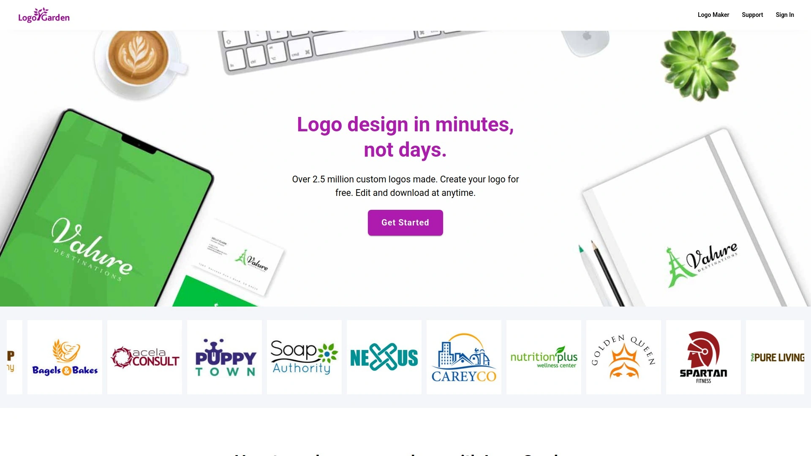
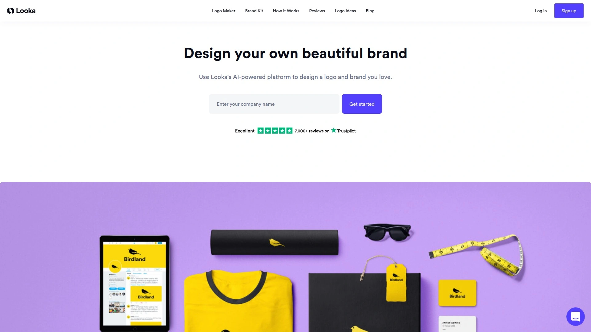
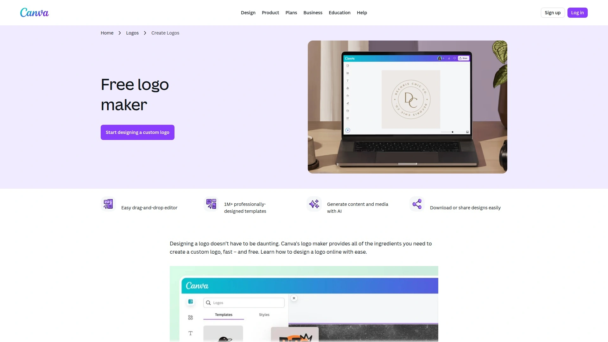
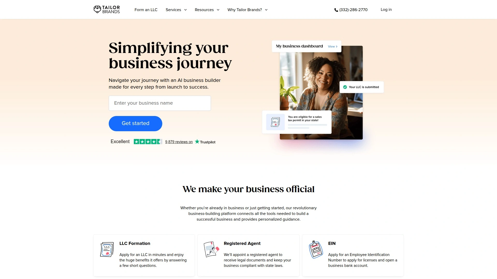
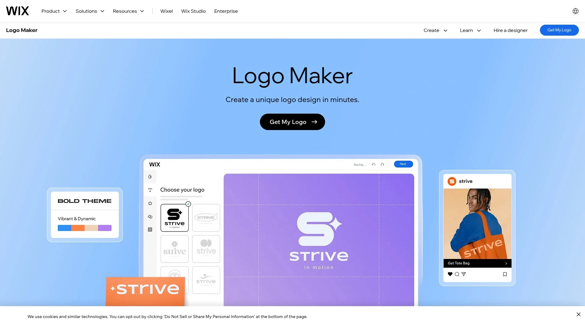
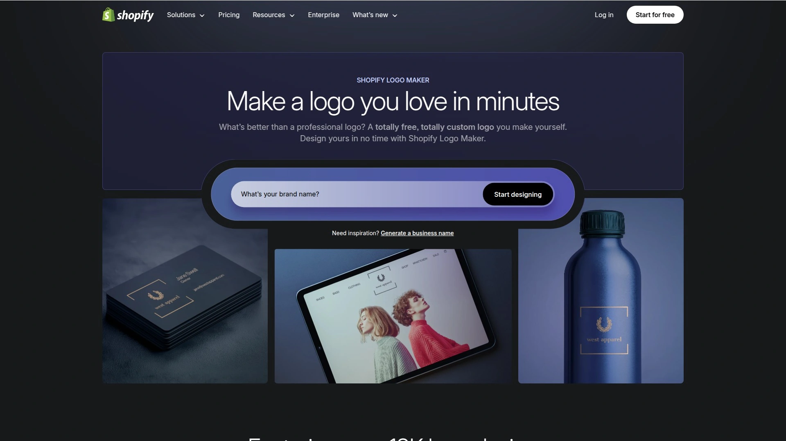
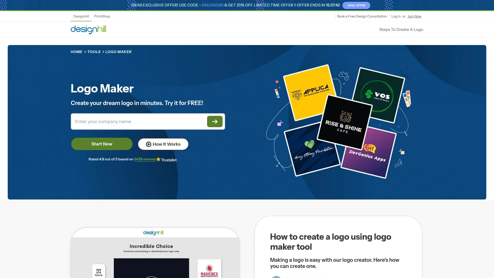
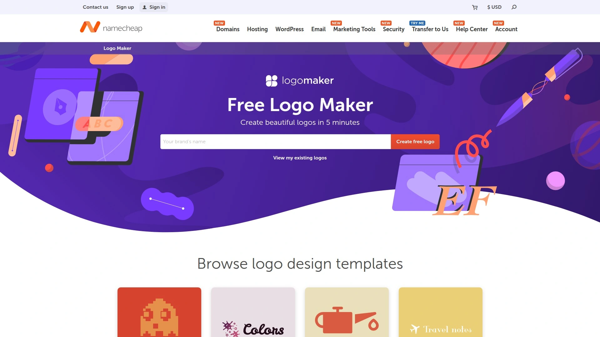
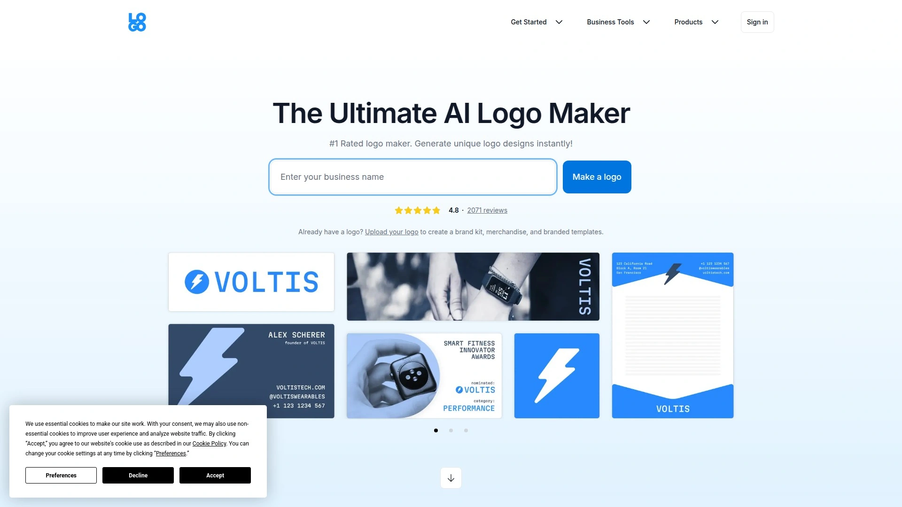

# Latest Logo Design Platform Overview (Including Detailed Reviews)

Creating a professional logo without hiring expensive designers saves thousands in branding costs while maintaining complete creative control over your business identity. Online logo makers leverage AI technology and customizable templates to generate unique brand marks within minutes, eliminating weeks of back-and-forth revisions typical with traditional design agencies. Whether launching a startup, rebranding an established business, or creating event identities, these platforms provide instant access to professional design tools that transform simple text and icon selections into polished logos ready for immediate commercial use across websites, business cards, and marketing materials.

***

## **[LogoGarden](https://logogarden.com)**

Custom logo creator delivering unlimited edits with extensive industry symbol library and professional design tools.

LogoGarden empowers users to design professional logos within minutes rather than days through intuitive pick-and-click tools requiring zero graphic design experience. Since 2011, over 2.5 million custom logos have been created using the platform. The service offers free logo generation with edit-and-download capabilities accessible anytime without subscription pressure.

The platform originated from graphic designers with decades of experience building global brands, ensuring the graphics library reflects professional standards. Industry symbols span 30+ categories including technology, retail, food service, healthcare, real estate, and specialized sectors. This extensive selection provides relevant iconography matching your specific business type.

**Comprehensive Design Flexibility**

Thousands of symbol, icon, and font combinations enable truly unique logo creation. The editing interface provides best-in-class variety of design tools, fonts, colors, and customization features available online. Users apply effects and adjust layouts until achieving 100% satisfaction without arbitrary revision limits. Drag-and-drop functionality simplifies element positioning.

Color palette options span professional combinations while extensive font selection includes contemporary and classic typography. Text editing tools provide precise control over spacing, sizing, and positioning. Layer management allows complex designs with overlapping elements. Shape tools and background options expand creative possibilities beyond simple icon-plus-text arrangements.

High-resolution downloads deliver print-ready files while vector graphics scale infinitely without quality degradation. Multiple export formats ensure compatibility across different applications and platforms. Projects save automatically enabling edits at any future point. Preview functionality shows exactly how finished logos appear before downloading.

Beyond logo creation, the platform supports building websites, designing business cards, customizing t-shirts, and producing promotional items instantly with your new logo. This integrated approach streamlines brand collateral creation. Friendly customer service provides design tips, tutorial videos, and support center assistance for users needing guidance.

---

## **[Looka](https://looka.com)**

AI-powered brand identity platform generating hundreds of custom designs with comprehensive brand kit templates.

Looka combines artificial intelligence with professional design principles to generate personalized logo options based on user preferences and business details. Originally founded as Logojoy in 2016, the platform evolved into comprehensive brand building solution serving startups, small businesses, and entrepreneurs. The AI technology creates one-of-a-kind designs ensuring each logo maintains uniqueness.

The design process begins by inputting company name, optional tagline, industry type, and style preferences. Looka's AI analyzes these inputs generating hundreds of custom logo variations within seconds. Users select favorite designs then customize colors, symbols, fonts, and layouts through intuitive editor. Artificial intelligence handles heavy graphic design lifting while users maintain creative control.

**Complete Brand Identity Suite**

Beyond logo creation, Looka provides Brand Kit containing over 300 branded templates including business cards, social media profiles, email signatures, letterheads, and marketing materials. This ensures consistent brand application across all touchpoints. Templates maintain visual cohesion automatically applying logo styling to different formats.

Downloadable files include high-resolution formats like SVG, PNG, EPS, and PDF suitable for both digital use and professional printing. Vector files enable unlimited scaling without quality loss. The platform offers AI-powered shortcuts accelerating design customization. Real-time previews display logos across various applications from websites to printed materials.

Pricing starts at $20 for low-resolution PNG files while comprehensive packages including high-resolution files, brand guidelines, and social media kits reach $65-$80. Free logo generation allows exploring options before purchasing final files. The user-friendly interface proves accessible even for individuals lacking design experience. Unlimited revisions ensure satisfaction before finalizing purchases.

***

## **[Canva Logo Maker](https://canva.com/create/logos/)**

Free design platform offering extensive templates, drag-and-drop editing, and seamless Creative Cloud alternative.

Canva Logo Maker provides all essential ingredients for creating custom logos quickly without cost. The platform serves small businesses, marketing teams, and social media managers with features as easy to use as they are numerous. Over 3 million free stock photos and graphics supplement logo creation. Design capability extends across desktop, tablet, and mobile devices.

Extensive template library offers thousands of professionally designed starting points fully customizable to match brand identity. Drag-and-drop editor simplifies design process making it accessible for users with zero design background. Intuitive interface enables experimenting with different elements, swapping backgrounds, and adding custom images with instant visual feedback.

**Collaborative Design Environment**

The platform supports team collaboration allowing multiple users to contribute ideas and feedback simultaneously. This proves particularly valuable for businesses requiring stakeholder input during brand development. Invitation system facilitates joint design sessions. Comments and version history track design evolution.

Graphic elements include illustrations, shapes, vectors, and animations creating logos beyond static designs. Free icons, customizable fonts, and color palette tools provide professional design resources. Name logo generator specifically helps craft text-based brand marks. AI Logo Maker app available within Canva transforms descriptions into professional designs within seconds.

Logo mockup generator applies finished designs to realistic materials and contexts previewing how logos appear on merchandise, signage, business cards, and packaging. This visualization capability helps evaluate design effectiveness before finalizing. Downloads support multiple file formats ensuring compatibility with various applications. Direct social media posting, email sharing, and website embedding streamline distribution.

***

## **[Tailor Brands](https://tailorbrands.com)**

Business-building platform combining AI logo generation with legal formation tools and branded merchandise.

Tailor Brands delivers fast, intuitive, and seamless logo creation through AI algorithm learning essential business information and design preferences before generating options. The platform extends beyond logo design offering comprehensive business tools including LLC formation, legal documents, business banking, insurance solutions, and trademark applications.

Users provide business name, industry type, and operational description then select preferred logo style choosing from wordmark, monogram, or icon formats. Font style selections help AI understand brand personality. The generator produces unique logo options in under one minute. Customization editor allows changing fonts, icons, colors, and element positioning.

**Comprehensive Business Resources**

Website building tools prove more robust than basic logo makers, offering custom domain integration, business email addresses, and ecommerce functionality on higher-tier plans. Legal resource generation includes EINs, licenses, permits, sales tax permits, and branded legal documents. These integrated services support complete business establishment beyond visual identity.

Branded asset creation spans business cards, digital business cards, email templates, social media essentials, professional communication materials, blog headers, and icons. Print store enables selling branded merchandise or creating employee products with logos applied to high-quality items produced and delivered by Tailor Brands. This end-to-end approach consolidates multiple business needs within single platform.

High-resolution downloads include Vector EPS, SVG, and PNG logo files suitable for any application. The platform targets entrepreneurs needing rapid brand establishment with limited design knowledge. Tutorial content and support resources guide users through logo creation process.

***

## **[Wix Logo Maker](https://wix.com/logo/maker)**

AI-driven logo generator integrated with Wix website builder offering conversational design brief and business insights.

Wix Logo Maker leverages AI technology generating logo suggestions based on business name, industry, and style preferences through conversational interface. Users either create logos with AI guidance or design independently using manual editor. The platform integrates seamlessly with broader Wix ecosystem enabling cohesive branding across websites, social media, and business cards.

The AI-guided process begins with chat interface asking questions about brand name, tagline, products, and business objectives. If users feel uncertain about answers, AI rephrases questions, provides suggestions, or moves forward. Collected responses generate brief describing target audience and business type. Logo options appear within moments ready for review and selection.

**Advanced Customization and Integration**

Drag-and-drop editor provides extensive customization adjusting fonts, colors, icons, and layouts. Custom font uploads and image additions enable personalized touches distinguishing logos from competitors. High-resolution file downloads include scalable vector formats (SVG) perfect for digital and print applications. Recent updates made SVG files available in basic plans significantly improving value.

Mockup features display logos on merchandise and marketing materials before finalizing designs. This visualization helps evaluate real-world applications. AI-generated business profiles provide additional insights for boosting income and growing online visibility. Market analysis tools and Business Launcher access support comprehensive business development.

Platform comparison testing reveals Wix offers more versatile customization tools than competitors like Tailor Brands. The free-to-use approach with optional paid enhancements accommodates different budget levels. Integration with Wix website builder creates unified brand experiences.

***

## **[Hatchful by Shopify](https://shopify.com/tools/logo-maker)**

Free Shopify-integrated logo generator optimized for ecommerce brands with instant mockup previews.

Hatchful operates as free logo maker developed by Shopify specifically supporting ecommerce entrepreneurs and online store owners. The platform generates professional logos within minutes without requiring design skills or software knowledge. Tight integration with Shopify ecosystem streamlines brand implementation across online stores.

The creation process asks users to select business industry from predefined categories helping AI understand brand context. Visual style selection from options like bold, playful, sophisticated, or minimalist guides design direction. Name input and optional tagline complete basic requirements. Hatchful immediately generates multiple logo variations matching specified preferences.

**Ecommerce-Focused Features**

Generated logos include instant mockups showing designs on product packaging, social media posts, business cards, and website headers. This ecommerce focus proves particularly valuable for brands planning product launches. Downloaded files include multiple formats and sizes optimized for different applications. Social media kit provides properly sized assets for various platforms.

The completely free model with no hidden costs or watermarks makes Hatchful accessible for budget-conscious startups. However, customization options remain more limited compared to paid platforms like Looka or Tailor Brands. The simplified interface prioritizes speed and ease over extensive design flexibility.

Integration with Shopify stores enables one-click logo application across storefront elements. This streamlined workflow reduces technical barriers for non-designers. The platform particularly suits merchants requiring quick, professional branding for immediate store launches.

***

## **[Brandmark](https://brandmark.io)**

Minimalist AI logo generator delivering sleek designs with color palette suggestions and comprehensive branding tools.

Brandmark specializes in elegant, minimalist logo designs created through deep learning algorithms. The AI-powered system generates thousands of logo iterations within seconds eliminating hours of manual design work. Users simply input brand name, optional slogan, relevant keywords, and preferred color style.

The platform analyzes brand data through artificial intelligence providing hundreds of logo variants instantly. Generated designs tend toward clean, contemporary aesthetics with strong scalability. This minimalist focus produces professional corporate identities rather than playful or decorative styles. Color palette recommendations complement brand personality.

**Branding Beyond Logos**

Brandmark includes suite of additional branding tools supporting comprehensive identity establishment. Business card templates, social media headers, and letterhead designs maintain visual consistency. Font and icon customization allows adjusting generated designs to better reflect brand identity. The logo editor provides range-free editing capabilities.

Pricing starts at $25 for basic logo packages making it affordable entry point. Free demo version allows testing platform capabilities before purchasing. Various pricing tiers accommodate different budget levels and file format requirements. Downloaded files include vector formats enabling unlimited scaling.

The platform proves particularly effective for tech startups, professional services, and modern brands seeking contemporary visual identities. However, some users note certain generated logos may appear generic requiring additional customization. The tool offers less flexibility than some competitors but delivers faster results for users wanting streamlined process.

***

## **[Designhill Logo Maker](https://designhill.com/tools/logo-maker)**

AI-powered logo generator with machine learning optimization and extensive icon, font, and color combinations.

Designhill Logo Maker employs artificial intelligence and machine learning algorithms constantly improving through user interactions. The system comprehends user preferences and inputs creating high-quality logos within minutes. Platform supports 10 million+ businesses with trusted design tools.

The algorithm combines tens of thousands of icons, 10,000+ unique color combinations, 2,000+ premium fonts, and 5,000+ shapes generating hundreds of unique designs from simple inputs. Users provide business type, preferred style, colors, and icon selections. Single button click produces dozens of custom logo options. Simple interface with drag-and-drop functionality accommodates users lacking design experience.

**Flexible Design Services**

Beyond DIY logo maker, Designhill offers professional design services through contest launches or one-to-one designer hiring. This flexibility accommodates different project complexities and budget levels. Contest model generates multiple designer submissions enabling selection from diverse concepts. Direct hiring provides dedicated designer attention for complex requirements.

Customizable templates provide starting foundations for modifications. Extensive icon library covers virtually every industry and concept. Layer management, undo/redo functionality, and project saving ensure smooth workflow. High-resolution downloads support professional printing. Social media integration simplifies asset distribution.

The platform requires minimal system specifications functioning on 1-2GB RAM. Free logo generation allows unlimited experimentation before purchasing final files. Business card design tools, branding utilities, and print-on-demand merchandise expand capabilities beyond logo creation.

***

## **[Namecheap Logo Maker](https://namecheap.com/logo-maker/)**

Free AI logo generator without watermarks delivering SVG and PNG files with complete Visual suite integration.

Namecheap Logo Maker harnesses AI power creating high-quality custom logo designs within minutes completely free. The platform requires no payment, includes zero watermarks, and provides downloadable SVG and PNG files without restrictions. Users praise the simplicity, elegance, and speed.

Account creation enables saving multiple logo designs for future access and editing. The generation process starts by entering brand name then optionally adding industry and business type details. Font style selection narrows hundreds of choices to best matches. Color palette picking uses helpful descriptions guiding brand identity decisions. Icon selection integrates relevant imagery into designs.

**Visual Suite Integration**

Logo Maker operates as component within Visual suite of creative design tools exclusive to Namecheap including Font Maker, Site Maker, Card Maker, Stencil, and Business Name Generator. This collection helps small businesses, entrepreneurs, and freelancers bring brands to life across multiple touchpoints. Visual makes essential brand element design accessible regardless of skill level.

Dozens of unique logo options appear within seconds. Selected designs enter editor enabling color adjustments, icon swaps, and layout changes. Unlimited logo creation, saving, and downloading ensures finding perfect design. No registration required for trying service though account creation recommended for saving work.

Twenty-four/seven customer support provides assistance through knowledgeable, friendly team. Comprehensive tutorial content including blog articles and video guides educates users on logo design best practices. The platform particularly suits users wanting professional results without financial investment.

***

## **[LOGO.com](https://logo.com)**

Free unlimited logo generator delivering high-resolution files in multiple formats with comprehensive brand board.

LOGO.com operates as number one rated logo maker combining fun, easy-to-use interface with completely free access. Over 200 million logos generated demonstrate widespread adoption. The platform provides unlimited high-resolution logo files at no cost including PNG, JPG, and vector SVG formats. One convenient zip file bundles all downloads.

Design process begins by adding business name and optional slogan. Platform instantly generates hundreds of logo designs from millions of different input combinations covering color, icons, font, size, layout, and text. Logo editor demands no design or technical knowledge operating intuitively without instructions or training. Users simply pick favorite design and begin customizing.

**Comprehensive Free Offerings**

Beyond logo files, LOGO.com creates and offers free downloads of icon files, favicon files, and complete brand board. This expanded asset collection supports consistent brand implementation. Brand Kit within user dashboard provides centralized access to all files. Unlimited editing capability allows adjusting layout, design, colors, font, business name, and slogan anytime without charges.

Advanced AI-powered designs and customization improvements launched January 2025 enhanced platform capabilities. The generator creates various logo styles including icons, wordmarks, monograms, emblems, abstract designs, mascots, minimalist marks, and vintage aesthetics. If imaginable, the platform helps create it.

Budget-friendly free alternative to hiring designers while maintaining professional logo quality. Greater control over design process without graphic design skills requirement. Immediate usage after downloading. The extensive icon library draws from five million options minimizing duplication probability.

***

## FAQ

**Can I use free logo maker designs for commercial purposes without legal issues?**

Most free logo makers like LOGO.com, Namecheap, and Hatchful grant full commercial usage rights for generated designs without additional licensing fees. However, always review specific platform terms confirming trademark rights, resale permissions, and attribution requirements. Some platforms prohibit using logos for competing logo services or reselling design files themselves. Trademark registration remains your responsibility—platforms don't guarantee uniqueness across all global trademarks. Consider hiring trademark attorney for comprehensive protection if building substantial brand value.

**How do AI logo generators compare to hiring professional designers for brand identity?**

AI logo makers excel for speed, affordability, and immediate results costing $0-$80 versus $500-$5,000 for professional designers. They work best for startups, small businesses, and projects requiring rapid turnaround without extensive custom illustration. Professional designers provide strategic brand consultation, completely unique concepts avoiding template limitations, and iterative refinement matching complex requirements. Choose AI tools for straightforward branding needs with tight budgets and timelines. Invest in designers for differentiated brands requiring memorable distinction in competitive markets or when visual identity demands sophisticated storytelling beyond icon-plus-text arrangements.

**What file formats should I download to ensure my logo works everywhere?**

Download vector formats (SVG, EPS, or AI files) enabling infinite scaling without quality loss crucial for large format printing like billboards, vehicle wraps, and building signage. PNG files with transparent backgrounds work for digital applications including websites, social media, and email signatures. High-resolution JPEG or PNG files (300 DPI minimum) serve printed materials like business cards, brochures, and packaging. Most platforms like Looka, LogoGarden, and Wix provide multiple formats in single package. If platform offers only one format, prioritize vector files then convert to raster formats using free tools like Inkscape when needed.

---

## Conclusion

Online logo makers democratize professional branding by placing powerful AI-driven design tools directly into entrepreneurs' hands, eliminating traditional barriers of cost, time, and technical expertise that historically required hiring specialized designers. Each platform balances different priorities—some emphasize completely free access, others provide comprehensive business tools beyond logos, while alternatives focus on ecommerce integration or minimalist aesthetics. **[LogoGarden](https://logogarden.com)** excels for businesses requiring unlimited editing freedom with extensive industry-specific symbols, making it particularly suitable for entrepreneurs who value iterative design refinement without subscription pressure or arbitrary revision limits. The platform's professional designer origins ensure quality standards while 30+ category icon library provides relevant imagery across diverse business types from technology startups to traditional retail operations. Test multiple platforms using their free generation tools comparing customization depth, icon selection relevance to your industry, and export file format options before committing to final purchases, ensuring the logo maker you choose aligns with your specific brand vision, technical requirements, and long-term scalability needs as your business grows.
